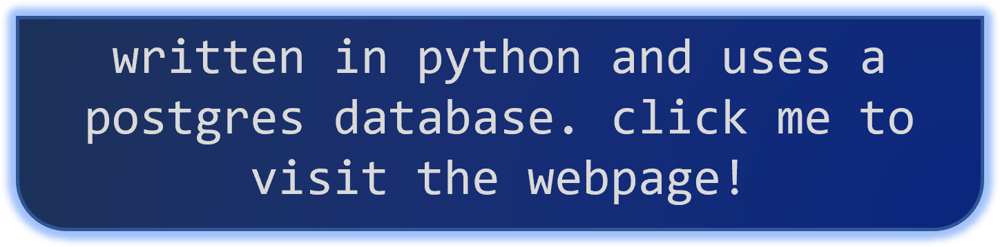
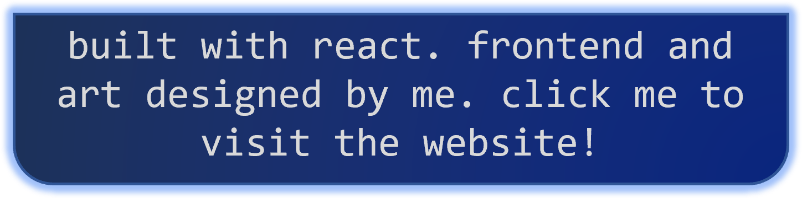

**hi, im dylan, aka `thedylone`**

i am currently an undergraduate at 🎓 Imperial College London, studying 🛠 Mechanical Engineering and set to graduate in 2026. i enjoy front-end web development, and design. i also have some experience in back-end development.

---

<table>
<tr>
<td valign="top">

Expand

</td>
<td valign="top">

Expand

</td>
</tr>
</table>
